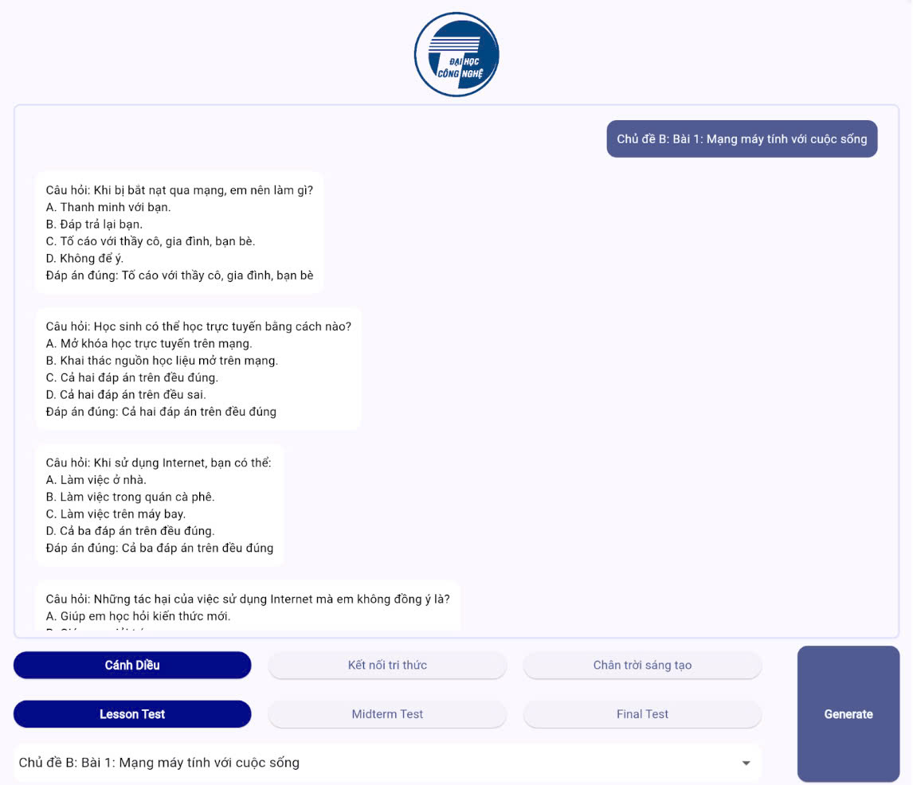

# mcqgen_app
 Multiple Choice Question Generation App for Thesis using Flutter and Gradio

## What I used
- Dart/Flutter
- Firebase
- Gradio API with Model hosting on Google Colab T4

## What this app can do
This app generates multiple-choice questions for teachers and students based on Notebook content.

Users select a lesson, and the app sends a request to a fine tuned LLM hosted on Colab T4 via the Gradio API. The LLM retrieves the corresponding context from the Firebase database, processes the request, and generates questions. The output is then sent back through the API and displayed in the Flutter app’s UI.

